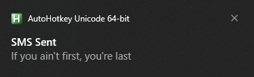
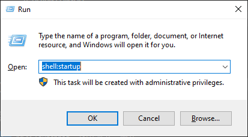
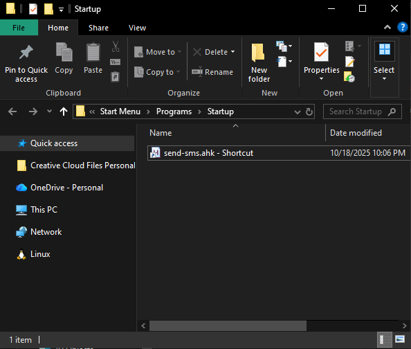
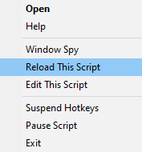

# HotkeySMS
### Simple AutoHotkey script to send SMS messages via Gmail SMTP using keyboard hotkeys.

Originally created for Reddit user /u/Gibscreen to add a "drink" button to a sim racing steering wheel that sends a text requesting a beer. Map your steering wheel button to a hotkey using your device's software (like SimHub or your wheel's configuration tool), then this script triggers the SMS on that hotkey.

## Gmail Setup Requirements

To send SMS messages through Gmail, you need to set up an App Password.

### Prerequisites

1. **Enable 2-Factor Authentication** on your Google account (required for App Passwords)
   - Go to https://myaccount.google.com/security
   - Enable 2-Step Verification

2. **Create an App Password**
   - Go to https://myaccount.google.com/apppasswords
   - Select "Mail" and your device
   - Google will generate a 16-character password
   - **Save this password** - you'll use it instead of your regular Gmail password in the script

## SMS Gateway Addresses

To send SMS via email, you need to know the recipient's carrier and use their SMS gateway address.

Format: `phonenumber@gateway.com` (no dashes or spaces in phone number)

Example: For phone number 555-123-4567, use `5551234567@gateway.com`

### Canada

- **Rogers**: `phonenumber@pcs.rogers.com`
- **Telus**: `phonenumber@msg.telus.com`
- **Bell**: `phonenumber@txt.bell.ca`
- **Fido**: `phonenumber@fido.ca`
- **Koodo**: `phonenumber@msg.koodomobile.com`

### USA

- **AT&T**: `phonenumber@txt.att.net`
- **T-Mobile**: `phonenumber@tmomail.net`
- **Verizon**: `phonenumber@vtext.com`
- **Sprint**: `phonenumber@messaging.sprintpcs.com`
- **US Cellular**: `phonenumber@email.uscc.net`
- **Boost Mobile**: `phonenumber@sms.myboostmobile.com`
- **Cricket**: `phonenumber@sms.cricketwireless.net`
- **Metro PCS**: `phonenumber@mymetropcs.com`

## Installation & Setup

1. Install AutoHotkey v1.1+ from https://www.autohotkey.com/
2. Edit `settings.json` with:
   - Your Gmail address
   - Your Gmail app password (from step 2 above)
   - Up to 3 recipients with their SMS gateway addresses (from the list above)
   - Configure up to 5 different messages
   - Assign hotkeys for each recipient/message combination (15 total possible)
3. Run `send-sms.ahk`
4. Press any configured hotkey to send the SMS

## Run Script Automatically on Windows Startup

To have the script run automatically when Windows starts:

1. Right-click on `send-sms.ahk`
2. Select **"Create shortcut"**
3. Press **Win+R** to open the Run dialog
4. Type `shell:startup` and press **Enter**

   

5. Move the shortcut you created into the Startup folder that opens

   

6. The script will now run automatically every time you log in to Windows

## Hotkeys

The script supports up to 15 hotkey combinations to send 5 different messages to 3 different recipients.

### Default Hotkey Layout

#### Recipient 1
- **Ctrl + Alt + Shift + 1** - Message 0
- **Ctrl + Alt + Shift + 2** - Message 1
- **Ctrl + Alt + Shift + 3** - Message 2
- **Ctrl + Alt + Shift + 4** - Message 3
- **Ctrl + Alt + Shift + 5** - Message 4

#### Recipient 2
- **Ctrl + Alt + Shift + 6** - Message 0
- **Ctrl + Alt + Shift + 7** - Message 1
- **Ctrl + Alt + Shift + 8** - Message 2
- **Ctrl + Alt + Shift + 9** - Message 3
- **Ctrl + Alt + Shift + 0** - Message 4

#### Recipient 3
- **Ctrl + Alt + Shift + A** - Message 0
- **Ctrl + Alt + Shift + S** - Message 1
- **Ctrl + Alt + Shift + D** - Message 2
- **Ctrl + Alt + Shift + F** - Message 3
- **Ctrl + Alt + Shift + G** - Message 4

Edit the recipients, messages, and hotkey mappings in `settings.json` to customize.

## Settings

- `gmailAddress`: Your Gmail address
- `gmailAppPassword`: Your Gmail app password (NOT your regular password)
- `timestampEnabled`: Set to `true` to add `[HH:mm]` timestamp to messages, `false` to disable
- `recipients`: Array of up to 3 recipients
  - `index`: Recipient index (0-2) for use in hotkey mappings
  - `name`: Recipient name (displayed in notification)
  - `smsGateway`: Recipient's phone number @ carrier's SMS gateway
- `messages`: Array of up to 5 messages (prefix with index number like `0:`, `1:`, etc.)
- `hotkeys`: Array of hotkey mappings
  - `hotkey`: AutoHotkey format (`^`=Ctrl, `!`=Alt, `+`=Shift)
  - `recipientIndex`: Which recipient to send to (0-2)
  - `messageIndex`: Which message to send (0-4)

> [!IMPORTANT]
> After changing any settings in `settings.json`, you must reload the script:
> - Right-click the AutoHotkey icon in the system tray
> - Select **"Reload This Script"**
>
> 

## Notes

- Requires AutoHotkey v1.1+
- The notification will show the SMS message that was sent
- The PowerShell script runs hidden in the background
